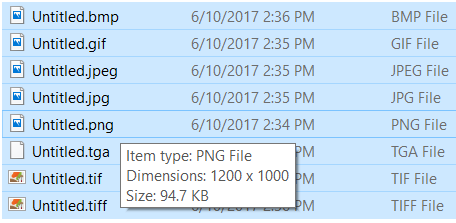
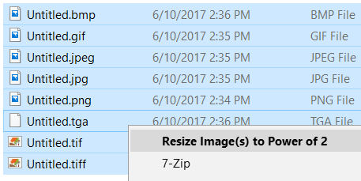
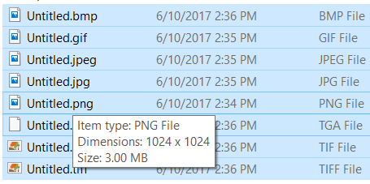
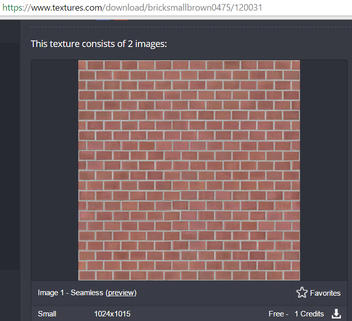
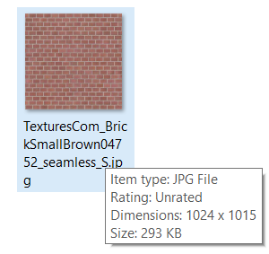
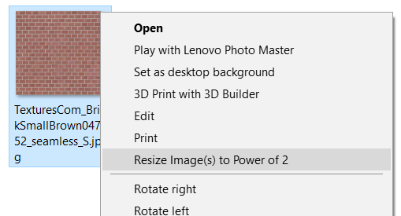
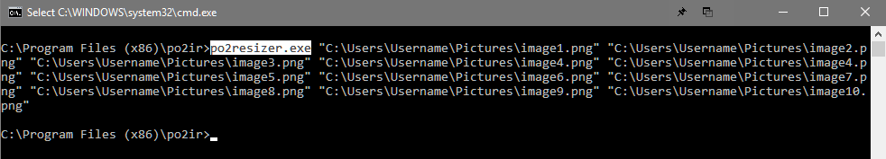

# Power Of 2 Image Resizer - *Optimize Game Engine Textures*

**About**
---

**CURRENTLY WINDOWS ONLY** - *you can still use the python script on any OS if you have the Python and the dependencies installed (pyGame and Pillow), but there is no shell extension, installer, or binary.*

This program resizes images to a power of 2 `(256, 512, 1024, 2048, etc.)`. Many game engines cannot use textures without them being a power of 2. Some game engines will use them with poor optimization and limited features. For example, in Unreal Engine, textures that are not a power of 2 cannot use texture streaming and will appear horribly jarring from a distance.
This program will take an image, find the closest power of 2 (using a user-defined threshold), and resize that image. So an image that is 1080x1200 would be resized (stretched in this case - images are never cut or cropped) to 1024x1024. Then they are ready to be used in a game engine.

As images are not cut or cropped, seamless textures will still be seamless, so no worries. Turn the compression down to 0 in the config if you are worried about lossiness. That will make these resizes lossless!

I made this program for my own use, as when working on game projects, I stumbled across thousands of wonderful free textures. The problem was that basically none of them were power of 2. Some would be 1000x1000 or 1200x1200 for example. So I found myself constantly opening bulky image editing programs, navigating through menus, finding the image resizing tool, manually typing in the new dimensions, and saving it. The whole process taking around 10 clicks and 30 seconds per file (if I was going fast). Going through hundreds of these, let alone thousands, is tedious, mind and finger numbing, and time-consuming. This takes care of everything for you *automatically!*

**Supported Image Types:**
* JPG
* PNG
* GIF
* BMP
* TGA*

*Targa files cannot be compressed.

There are more file types supported (anything supported by Pillow) like ICO, but they really won't be used for textures so I won't bother listing them.

This program is written in Python and uses [Pillow](https://github.com/python-pillow/Pillow) and [pyGame](https://www.pygame.org/docs/) (for Targa support).

**How to Use:**
---

After installing, simply right click on an image file or *multiple* selected image files and click "Resize Image(s) to Power of 2". **Easy!** 

    

     

It will resize all selected images to the closest power of 2. 

**You can also use it from the command line by using any number of images as the parameters.**

  

**Installation**
---
***Installing:***

Just run the po2ir-installer.exe. It contains all dependencies and will be installed in your Program Files in a folder named "po2ir".
The installer will add the following windows registry keys (needed for right-click context menu resizing):

* `HKEY_CLASSES_ROOT\SystemFileAssociations\image\shell\Resize Image(s) to Power of 2`
  * `MultiSelectModel = Player     (Needed for multiple selected context menu)`
* `HKEY_CLASSES_ROOT\SystemFileAssociations\image\shell\Resize Image(s) to Power of 2\command`
* `HKEY_CLASSES_ROOT\SystemFileAssociations\.tga\shell\Resize Image(s) to Power of 2`
  * `MultiSelectModel = Player     (Needed for multiple selected context menu)`
* `HKEY_CLASSES_ROOT\SystemFileAssociations\.tga\shell\Resize Image(s) to Power of 2\command`

***Uninstalling:***

Run the uninstaller exe in the po2ir folder. The uninstaller will also delete the registry keys.

**Configuration**
---
There will be a file called "config.txt" in the program folder ("C:/Program Files (x86)/po2ir/config.txt" on my own computer). You can edit 2 variables in there to control how the program behaves. There are also instructions in that file, which I will paste below:

> Threshold is how close an image has to be to a smaller power of 2 before it will be scaled down. Range from 0.0 to 1.0
>
>For instance, if I have an image that is 1025 pixels, I don't want to scale that up to 2048! I want it to lose one pixel and be 1024. But if I have an image that is 1600 pixels, perhaps I do want to scale up rather than down (because that would be a large loss of quality). Threshold is the percentage of how close to the smaller size it has to be. Default is 0.25. This means that if I had an image of size 1280, it would be scaled down to 1024 (1024 + (1024 * 0.25) = 1280). Anything above that would be scaled to 2048. If the threshold was 0.5, then anything below 1536 would be scaled down (1024 + (1024 * 0.5) = 1536). So 1.0 would be ALWAYS SCALE DOWN and 0.0 would be ALWAYS SCALE UP.
>
> Compression is just the level of compression to apply. PIL's default is 6. The default here is 5. 0 is no compression at all (although metadata will still say the file is compressed, I promise it's not!). Compression does not apply to TGA files, as they are always saved uncompressed. Range is from 0-9

**License**
---
MIT License

Copyright (c) 2017 Ryan Andrew Walters

Permission is hereby granted, free of charge, to any person obtaining a copy
of this software and associated documentation files (the "Software"), to deal
in the Software without restriction, including without limitation the rights
to use, copy, modify, merge, publish, distribute, sublicense, and/or sell
copies of the Software, and to permit persons to whom the Software is
furnished to do so, subject to the following conditions:

The above copyright notice and this permission notice shall be included in all
copies or substantial portions of the Software.

THE SOFTWARE IS PROVIDED "AS IS", WITHOUT WARRANTY OF ANY KIND, EXPRESS OR
IMPLIED, INCLUDING BUT NOT LIMITED TO THE WARRANTIES OF MERCHANTABILITY,
FITNESS FOR A PARTICULAR PURPOSE AND NONINFRINGEMENT. IN NO EVENT SHALL THE
AUTHORS OR COPYRIGHT HOLDERS BE LIABLE FOR ANY CLAIM, DAMAGES OR OTHER
LIABILITY, WHETHER IN AN ACTION OF CONTRACT, TORT OR OTHERWISE, ARISING FROM,
OUT OF OR IN CONNECTION WITH THE SOFTWARE OR THE USE OR OTHER DEALINGS IN THE
SOFTWARE.
